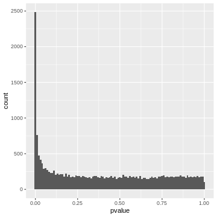
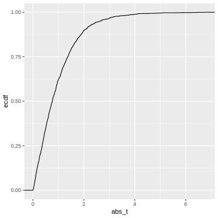
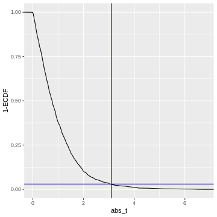

:::::::::::::::::::::::::::::::::::::: questions 

- How does correcting for the family-wise error rate (FWER) affect the number of significant hits in large-scale data, such as RNA-Seq analysis of 20,000 human genes?
- What is the interpretation of a p-value histogram, and how can it be used to assess the distribution of p-values in multiple testing scenarios?
- How can the Benjamini-Hochberg method be applied to control the false discovery rate (FDR) in RNA-Seq data, and what are the benefits of using this method over FWER correction?

::::::::::::::::::::::::::

:::::::::::::::::::::::::::::::::::::::::::::: objectives

- Demonstrate how correcting for the family-wise error rate (FWER) using methods like Bonferroni correction can lead to few or no significant hits in large-scale testing scenarios.
- Introduce the concept of p-value histograms, explain their interpretation, and illustrate how they can be used to visualize the distribution of p-values in multiple testing.
- Explain the Benjamini-Hochberg method for controlling the false discovery rate (FDR).
- Provide practical examples and R code to apply the Benjamini-Hochberg method to RNA-Seq data.
- Discuss the advantages of controlling the FDR over FWER in the context of large-scale genomic data. 

::::::::::::::::::::::::::::::::::::::::::::::::

# Introduction

In high-throughput experiments like RNA-Seq, we often conduct thousands of statistical tests simultaneously. This large number of tests increases the risk of false positives. While controlling the family-wise error rate (FWER), the probability of making at least one type I error, is one approach to address false positives, it can be too conservative, leading to few or no significant results. An alternative approach is to control the __False Discovery Rate (FDR)__, the expected proportion of false positives among the rejected hypotheses, which offers a balance between identifying true positives and limiting false positives. In this tutorial, we will learn how each method affects the outcome.

## Example: The Airway dataset in R

The Airway dataset contains gene expression data from a study investigating the effects of dexamethasone (a corticosteroid medication) on airway smooth muscle cells. The dataset is part of the airway package in Bioconductor, a project that provides tools for the analysis and comprehension of high-throughput genomic data.

In differential expression analysis, thousands of statistical tests are conducted: For each gene, one can test whether its expression is different in cells with dexamethasone treatment, compareed to cells without treatment. If the expression differs between the two condition, we call the gene differentially expressed (DE). 
Like in the previous example, we have a set up null hypotheses: 

$H_{0,1}$: Gene 1 is not DE. 

$H_{0,2}$: Gene 2 is not DE. 

...

$H_{0,20000}$: Gene 20000 is not DE. 

Unlike in the air pollution example, our question is not whether *any* of the genes is DE, but rather *which ones*: We'd like to come up with a hit list of genes that can be further investigated.

This is how the p-values are created:

```r
library(DESeq2)
```

If you like to work with them without running the code, you can load pre-computed p-values  as follows:

```r
### HERE SHOULD BE CODE FOR LOADING THE DATA
```


The table below shows the first six rows of the generated p-values for each gene, the data which, we are going use to see how using FWER and FDR to controlling for false positive differ. 


Table: Table 1: P_Values for each analysed gene

|gene            |    pvalue|
|:---------------|---------:|
|ENSG00000000003 | 0.0286636|
|ENSG00000000419 | 0.0428183|
|ENSG00000000457 | 0.7874802|
|ENSG00000000460 | 0.6972820|
|ENSG00000000938 | 0.6215698|
|ENSG00000000971 | 0.0885597|

20000 p-values are too many to list them all, but we can look at their distribution by visualizing a p-value histogram. A p-value histogram is a graphical representation that displays the distribution of p-values obtained from multiple hypothesis tests. It can help us in assessing the presence of true effects versus null effects and in understanding the overall behavior of the tests. It can also help us to better control for false positives. To understand how this works, we'll have to look into the theory. In the next section, we'll learn 

- that a p-value histogram is composed of two fractions: the null and the alternative 
- what behavior we expect from the null fraction

Understanding this will provide us with a tool for controlling the False discovery rate.

# The Theory of P-value Histograms

To create a p-value histogram, we plot the p-values on the x-axis, typically ranging from 0 to 1. The y-axis represents the frequency (or count) of p-values falling within specific bins (intervals) of the x-axis.
Let's do this for the `airway` p-values.


```r
gene_pvalues %>% 
  ggplot(aes(x=pvalue))+
  geom_histogram(binwidth=0.01)
```

```{.warning}
Warning: Removed 51 rows containing non-finite values (`stat_bin()`).
```



## A p-value histogram is composed of two fractions

We can think of the p-value histogram as being composed of two fractions: the alternative and the null fraction.


Together, the alternative and null fraction give us a p-value histogram as the one observed for the `airway` data.

## Why are these our expectations of the null and alterative fraction?

Let's start with the easier case: If we use a statistical test that is good at detecting differentially expressed genes, then it will produce low p-values for the DE genes, resulting in a peak close to 0. Depending on the power of the test, the peak towards 0 is sharp (high power, all the DE genes have low p-values) or flat and less pronounced (low power, many DE genes have p-values >>0). 

But why do we expect a uniform distribution of p-values that come from genes where the null hypothesis is true? This comes from the definition of p-values. We expect 5% of the p-values to be $<0.05$, 10% of the p-vales to be $<0.1$, etc. 
Unfortunately, for many this definition is not intuitive. Therefore, we use a simulation of tests where the null hypothesis is true, and use it to recap the definition of p-values. 


We learned that in the t-test, the test statistic $t$ follows a *t-distribution* under the null hypothesis. So, when the null hypothesis is true, we expect the value of $t$ to be randomly drawn from a t-distribution.
For demonstration purposes, we can simulate 2000 draws from a t-distribution (here, I choose the degrees of freedom to be $\nu = 5$, which is an arbitrary choice) and visualize their distribution.

```r
set.seed(55)
ts <- rt(2000, df=5)
data.frame(t=ts) %>% 
  ggplot(aes(x=t))+
  geom_histogram(binwidth=0.2)+
  labs(main="Null distribution of t")
```


This is our null distribution!

Since we'll decide significance based on the absolute value of t, $|t|$, I'll calculate it here: 

```r
abs_t <- abs(ts)# take their absolute values
data.frame(abs_t=abs_t) %>% 
  ggplot(aes(x=abs_t))+
  geom_histogram(binwidth=0.1)+
  labs(main="Null distribution of |t|")
```


This is our null distribution of absolute t-values. 
In hypothesis testing, we ask: "What is the probability in the null distribution to observe a value at least as extreme as the observed $|t|$?" 
So, what we're looking at to answer this question is the *cumulative distribution* of $|t|$. While in practice, we're looking at the theoretical cumulative distribution, we'll here look at the cumulative distribution of our simulation, hence an *empirical* cumulative distribution. 


```r
data.frame(abs_t = abs_t) %>% 
  ggplot(aes(x=abs_t))+
  stat_ecdf()
```


This cumulative distribution function answers the question "for a given value of $|t|$, how many other elements of the simulation are *smaller than* this value?". Which is exactly the opposite of what we're asking when calculating a p-value. In fact, the p-value is defined as $1-\text{CDF}(|t|)$, which looks like this:


```r
data.frame(abs_t = abs_t) %>% 
  ggplot(aes(x=abs_t))+
  geom_line(aes(y = 1 - ..y..), stat='ecdf')+
  labs(y="1-ECDF")
```



Code adapted from [here](https://stackoverflow.com/questions/37221303/how-to-plot-reverse-complementary-ecdf-using-ggplot).
So when we calculate a p-value, we (visually speaking) look up the observed value of $|t|$ (`abs_t`) on the x-axis, and match it to the corresponding 1-ECDF on the y-axis, which is the resulting $p$. 

What does this tell us about the distribution of p-values? 
We could go and slice the 1-ECDF into chunks of 5% of the data points:

```r
data.frame(abs_t = abs_t) %>% 
  ggplot(aes(x=abs_t))+
  geom_line(aes(y = 1 - ..y..), stat='ecdf')+
  labs(y="1-ECDF")+
  geom_hline(yintercept = seq(0,1,by=0.05),
             col="gray")
```


The observations in each slice will make up one bin in the p-value histogram which we're going to create next.

All of these chunks should contain about 5% of the p-values - **by the definition of the p-value via the cumulative distribution**.


For instance, the upper 5% of the $|t|$-values are be between $2.6$ and $6.8$, so we give them p-values between 0.00 and 0.05. The next 5% of the $|t|$-values will be between $2.0$ and $2.6$, so we give them p-values between 0.05 and 0.10. And so on... resulting in the following p-value histogram again sliced by 5%-bins for demonstration:


```r
data.frame(abs_t = abs_t) %>% 
  mutate(p = pt(abs_t, df=5,lower.tail=FALSE)*2) %>% 
  ggplot(aes(p))+
  geom_histogram(binwidth=0.05, boundary=0)
```


We could also define the p-value via the empirical null distribution:

```r
abs_t_vec <- abs_t
data.frame(abs_t = abs_t) %>% 
  rowwise() %>% 
  mutate(p = mean(abs_t>abs_t_vec)) %>% 
  ggplot(aes(p))+
  geom_histogram(binwidth=0.05, boundary=0)
```


Again, each 5% bin contains 5% (=100) of the p-values, because the p-values are defined by the percentage of values of $|t|$ in the simulated null distribution which are smaller than the observed one. 

### Recap

- p-values are defined as via the cumulative distribution of the test statistic under the null hypothesis 
- They answer the question: what percentage of values is expected more extreme than the observed one? 
- If we bin our data into equally-sized quantiles, we expect to see roughly the same number of p-values in each quantile. 
- Therefore: In a set of tests where the null hypothesis is true, and where the test statistic behaves like expected in theory, we will see a uniform distribution of p-values 
- This works for any test statistic, *as long as we know its distribution*

# The False Discovery Rate

Let's come back to our p-value histogram of differentially expressed genes.
We learned that it is composed of null and alternative fraction, and we learned that in theory, the null fraction is uniformly distributed.

We can use this knowledge to estimate the fraction of false positives among the positives at an arbitrary p-value cut-off. This is illustrated below.


Say, we determine some cut-off p-value, indicated by the red line. Then we can visually estimate what percentage of tests right at this threshold are false positives, namely by dividing the length of the light red segment by the overall length of the line. That’s the local __fdr__, and it applies to tests rejected just at this threshold. 
Now we will probably reject all the tests below the threshold, and to get the fraction of false positives within those, we divide the dark gray area by the the total area to the left of the red line. This is the capital letter __FDR__ and it’s an average property of all tests rejected below the threshold.

The false discovry rate is defined as 
$FDR = \frac{FP}{TP+FP}.$

## In our example


## Adjusted p-values

At any given p-value cut-off, we can estimate the FDR. So could take each p-values in our screen, use it as a cut-off and return the estimated FDR. This is the adjusted p-value. It tells us the FDR that we would have for our hits if we rejected the null for all genes with a p-value equal to or lower than that for this gene.
We can then decide to call all tests a hit, for which the adjusted p-value is smaller than the desired $\alpha_\text{FWER}$.


### Trade-off FP and FN

If we set the threshold very low, we will have a low FDR (low fraction of false positives), but will miss many of the differentially expressed genes. When we move the red line to the right, that is increase the threshold, we’ll capture more and more of the differentially expressed genes, but at the cost of more and more false positives, and if we go too far, we will almost exclusively admit more False Positives.


### More on p-value histograms

If you encounter p-value histograms that don't fit the expectation we just discussed, have a look at this [post in varianceexplained.org](http://varianceexplained.org/statistics/interpreting-pvalue-histogram/)


## Controlling FDR Using the Benjamini-Hochberg Method

The Benjamini-Hochberg (BH) method is a statistical procedure used to control the FDR in multiple hypothesis testing, where the chance of obtaining false positives increases. The BH method helps control the proportion of false positives (false discoveries) among the rejected hypotheses, thus providing a more balanced approach than traditional methods like the __Bonferroni correction__, which can be overly conservative. The BH procedure adjusts the p-values from multiple tests to control the FDR. These adjusted p-values can be compared to a significance threshold to determine which results are significant.

### Steps of the Benjamini-Hochberg Procedure
First the observed p-values are arranged in ascending order. Next, ranks are assigned to the p-values, with the smallest p-value getting rank 1, the next smallest rank 2, and so on. Then, for each p-value, the BH critical value is calculated as;

$$\text{BH critical value} = \frac{i}{m} \times Q$$

where, i is the rank, m is the total number of tests, and 
Q is the desired FDR level (e.g., 0.05).

After this calculation, the largest p-value that is less than or equal to its BH critical value is identified. This p-value and all smaller p-values are considered significant. Optionally, one can adjust the p-values to reflect the BH correction using software functions.

Now, let us continue with the generated p_values to apply the Benjamini-Hochberg correction in r, and also plot the adjusted p values for comparison. 

What the  Benjamini-Hochberg algorithm does, is that it estimates the null component, and finds the threshold below which we should reject for a desired FDR. Equivalently, and that’s the way it’s implemented in R, we could say it produces adjusted p-values. And if we reject everything below a certain adjusted p-value (say 5%), this will lead to an FDR of 5%, meaining that 5% of the hits are false-positives.

# Wrap up

We discussed that controlling the FDR trades some false positives for the chances to discover more hits. Let's compare the three error rates that we encountered so far 
- comparison-wise error rate
- family-wise error rate 
- false discovery rate

in terms of the number of hits they return.

We can check how many genes were significantly differentially expressed between the treated and untreated cells at α=0.05 before we apply any type 1 error correction method:


```{.output}
4655 is the number of significant differentially expressed genes before FWER correction
```


Now, if we proceed to apply the Bonferroni method to correct the family-wise error rate (FWER), we can then determine the number of genes that show significant differential expression after the correction. 

:::::::::::::::::::::::::: challenge 
- Use `p.adjust` to calculate adjusted p-values using Benjamini Hochberg. How many hits do you get if you control the FDR at 10%?
- Do the same with Bonferroni


::::::::::::::: solution 


```r
alpha=0.1
# Apply Benjamini-Hochberg correction
p_adjusted <- p.adjust(gene_pvalues$pvalue, method = "BH")
significant_bh <- p_adjusted < alpha
Benjamini_Hochberg_genes<-sum(significant_bh) # Number of significant hits after Benjamini-Hochberg correction
Benjamini_Hochberg_genes
```

```{.output}
[1] 2908
```


```r
alpha=0.1
# Apply Bonferroni correction
p_adjusted <- p.adjust(gene_pvalues$pvalue, method = "bonferroni")
significant_bonferroni<- p_adjusted < alpha
bonferroni_genes<-sum(significant_bonferroni) # Number of significant hits after bonferroni correction
bonferroni_genes
```

```{.output}
[1] 759
```


:::::::::::::::::::

::::::::::::::::::::


```{.output}
706 is the number of significant differentially expressed genes after Bonferroni correction for FWER
```

Applying the Bonferroni correction in this example results in __706__ differentially expressed genes due to the stringent threshold, demonstrating how FWER correction can be too conservative in large-scale testing.


```{.output}
2357 is the number of significant differentially expressed genes that pass the FDR threshold
```


The Benjamini-Hochberg method controls the FDR, allowing for a greater number of significant differentially expressed genes (__2357__) compared to the Bonferroni correction (__706__). This approach provides a more balanced and powerful method for identifying true positives in large-scale data.


## Advantages of controlling the FDR over FWER in the context of large-scale genomic data

- Higher statistical power: FDR control allows for higher power compared to FWER control. In large-scale genomic studies, this means detecting more true positives while still controlling false discoveries. Therefore, since FDR methods are less stringent than FWER methods like Bonferroni correction, they balance between controlling false discoveries and maximizing true positives, reducing false negatives.

- Consistency across studies: By setting a fixed FDR threshold (e.g., 5%), results are more comparable across different studies and meta-analyses, enhancing consistency in statistical inference.

It is important to note that while FDR is preferred in many genomic screens due to its ability to handle a large number of hypotheses, FWER control remains appropriate in scenarios where minimizing any false positives is critical. Each method has its place depending on the research context and goals.

## What control method should we choose?

It is essential to understand the difference between controlling the False Discovery Rate (FDR) and the Family-Wise Error Rate (FWER) as each applies to different research scenarios.

Controlling the FDR is suitable in situations where it is often acceptable to have some false positives, such as in large-scale biological screenings (e.g., genomics, proteomics). The goal is to identify as many true positives as possible, knowing that some false positives can be filtered out in subsequent validation steps.

On the other hand, controlling FWER is suitable in high-precision scenarios requiring strict control of false positives. In scenarios where false positives can have significant consequences (e.g., clinical trials, diagnostic tests), it is crucial to minimize even a single false positive. Here, FWER control is more appropriate because it ensures a lower risk of making any type I error.

Therefore, it is important to understand that in exploratory research, where the aim is to generate hypotheses or discover potential leads, FDR control is preferred due to its higher power. In confirmatory research, where results need to be highly reliable, FWER control is more suitable.

### Take home message

While FDR control is widely used in biological research due to its balance between discovery and false positive control, FWER control is crucial in settings where the cost of even a single false positive is high. Each method serves its purpose depending on the specific goals and acceptable risk levels of the research context. Understanding the trade-offs between these approaches allows researchers to choose the most appropriate method for their specific scenario.

## Further reading 

- [How to interpret a p-value histogram]("http://varianceexplained.org/statistics/interpreting-pvalue-histogram/")


:::::::::::::::::::::::::::::::::::::::::::::::::::::::::::::::::::: instructor

If there's too much time at hand, one could also make a quiz out of the different histograms shown in the varianceexplained post, and discuss what they could mean. 

::::::::::::::::::::::::::::::::::::::::::::::::::::::::::::::::::::::::::::::::
