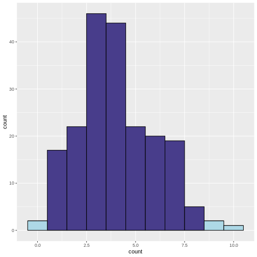

:::::::::::::::::::::::::::::::::::::: questions 

- What is multiple testing? 
- How are false-positives related to the significance level?

::::::::::::::::::::::::::

:::::::::::::::::::::::::::::::::::::::::::::: objectives

- Define multiple testing

::::::::::::::::::::::::::::::::::::::::::::::::

# What is multiple testing

Let's approach this question through an example and a recap on hyptothesis testing: Suppose the prevalence of a disease in the general population is 4%. In this population, lives a group of individuals who have all been exposed to air pollution. Concerned about their health, we decide to embark on a quest to uncover whether being exposed to air pollution influenced the risk of contracting this disease.


## Setting the null and alternative hypothesis

We would like to conduct a hypothesis test to find out whether the prevalence in the test group differs from the known 4%. For this, we define the null and the alternative hypothesis.

### Null Hypothesis ($H_0$)

The prevalence of the disease within test group exposed to air pollution is the same as the known prevalence in the general population (4%). This means that the proportion of individuals exposed to air pollution in the test group who have the disease is also 4%.

### Alternative Hypothesis ($H_1$)

The prevalence of the disease within the test group exposed to air pollution is different from the known prevalence in the general population. This means that the proportion of individuals exposed to air pollution in the test group who have the disease is either higher or lower than 4%.

## Data collection and testing

We assemble a group of 100  individuals who have been exposed to air pollution (test group) from the population and each individual is carefully examined, checking for any signs of the disease.
Out of the 100 individuals, we discover that 9 of them were indeed suffering from the disease, so the *observed* proportion is 9%. This is different from 4%,
but we are not satisfied with just this knowledge, since the observed difference in proportions could be due to chance. We want to know if this prevalence of the disease within the group exposed to air pollution was significantly different from the population's average, meaning that it's very unlikely to observe this difference just by chance.
So, we decide to perform binomial test (please refer back to [binomial test]("https://sarahkaspar.github.io/biostatistics-course/03-binomial.html")). With this test, we compare the observed prevalence within our group that has been exposed to air pollution to the known prevalence in the entire population.

We set our significance level beforehand, typically at $\alpha=0.05$, to determine whether the results are statistically significant.

Here, we run the test in R:

```r
#For known parameters (n=100, p=0.04), we calculates the the chances of getting the 9 individuals that indeed suffered from the disease. 
n = 100 # number of test persons
p = 0.04 # Known prevalence of the disease in the general population
binom.test(x=9, n=n, p=p)
```

```{.output}

	Exact binomial test

data:  9 and n
number of successes = 9, number of trials = 100, p-value = 0.01899
alternative hypothesis: true probability of success is not equal to 0.04
95 percent confidence interval:
 0.0419836 0.1639823
sample estimates:
probability of success 
                  0.09 
```

The obtained p-value is the probability of seeing an outcome as extreme as the observed one, assuming that the null hypothesis is true. If this probability is sufficiently low (below our chosen significance level), we reject the null hypothesis in favor of the alternative hypothesis.

The binomial test result (~0.02) reveals that the prevalence of the disease among the individuals exposed to air pollution is indeed significantly different from that of the population.

## What if we did many similar experiments?

Conducting a single study might not provide conclusive evidence due to various factors such as sample variability, random chance, and other unknown influences. 

We decide to investigate the potential impact of air pollution on disease prevalence in 200 various locations. We want to assess whether there is a significant difference in disease rates between groups exposed to air pollution and the average for the whole population. 


Let's now assume that in our scenario, there is *no* association between air pollution and the disease in *any* of the tested regions. 

:::::::::: challenge
# Vote 
What kind of results would you expect from running a series of tests in 200 regions? 

- no significant test 
- all tests significant 
- some tests significant 
::::::::::::::::::


To find out, we can simulate the scenario where we conduct 200 tests, each with a 5% chance ($\alpha = 0.05$) of producing a significant result (i.e., a p-value less than 0.05) even when the null hypothesis is true.

Our null hypothesis in each location is that there is no real difference in disease rates between the groups exposed to air pollution and the average for the whole population.


To do this, we write a script in R, which simulates study results when the prevalence in the test group is 4% (null hypothesis is true). We run these experiments to see what would happen if we kept doing tests even when there was not actually any difference. 


```r
library(tidyverse)
set.seed(33)

# define lower and upper bounds: beyond these bounds, results are significant
lower <- qbinom(0.025, size=100, prob=0.04)
upper <- qbinom(0.975, size=100, prob=0.04)

# Generate simulated data
data <- data.frame(
  count = rbinom(n=200, size=100, prob=0.04)
)

# add significance
data <- data %>% 
  mutate(significant = ifelse(
    (count < lower | count > upper), 1, 0))

data %>% 
  ggplot(aes(x=count, fill=factor(significant)))+
  geom_histogram(binwidth=1,color="black")+
   scale_fill_discrete(type=c("darkslateblue","lightblue"))+
  guides(fill = "none")
```


What does the above code do: 

- Determine lower and upper bounds for significance: A two-tailed binomial test calls counts significant that are either below the 2.5 percentile, or above the 97.5 percentile of the binomial distribution. We determine these bounds using `qbinom`. This gives us the bounds that contain 95% of the data under the null hypothesis.
- Determine significance: We then classify a group as `significant` if the observed number of patients falls below the 2.5th percentile or above the 97.5th percentile of the binomial distribution. 
- Plotting: We plot a histogram of the counts, and use the argument `fill` to color by the variable `significant`. We use `scale_fill_discrete` to manually determine the colors for significant and non-significant.


In the resulting histogram, we find that even in a world where there was no true difference in disease prevalence, about 5% of our simulated experiments yielded statistically significant results purely by chance (the light blue bars). 

It is important to note that the significance level (α) that we choose for each individual test directly impacts the rate of false positives. This is the __Comparison-Wise Error Rate (CWER)__, the probability of making a Type I error (false positive) in a single hypothesis test. In our example, we have set α=0.05 for each individual test, which means we are willing to accept a 5% chance of making a false positive error for each test, and this means that for 100 tests, we expect about 5 false positives.

By running this simulation multiple times, we can observe how often we get false positive results when there should be none. This helps us understand the likelihood of obtaining a significant result purely by chance, even if there is no true effect or difference.

::::::::::::::::: challenge

- If we set α=0.01 for each individual test, what is the number of false positives we should expect for 100 tests?
::::::::::::::::::::::

:::::::::::::::: solution
We expect 1 false positive on average.
::::::::::::::::::::::::::


## Summary

Multiple testing refers to the practice of conducting numerous hypothesis tests simultaneously or repeatedly on the same data set. It is typically motivated by the desire to explore different aspects of the data or to investigate multiple hypotheses. Researchers employ multiple tests to examine various relationships, comparisons, or associations within their data set, such as comparing means, proportions, correlations, or other statistical analyses that involve hypothesis testing. 

When we increase the number of conducted tests, this also increases the number of false positives to be expected among the tests where the null hypothesis is true. The *fraction* of expected false positives among the cases with true null is equal to the significance level $\alpha$ that we apply for each individual test. 

:::::::::::::::::::::::::::::::::::::::::::::::::::::::::::::::::::: instructor

Inline instructor notes can help inform instructors of timing challenges
associated with the lessons. They appear in the "Instructor View"

::::::::::::::::::::::::::::::::::::::::::::::::::::::::::::::::::::::::::::::::
